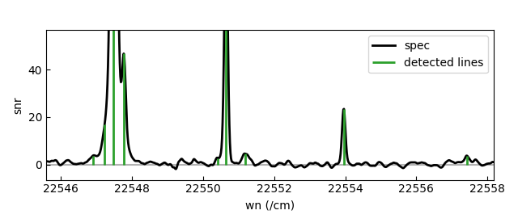

# FTS NN LL

A neural network (NN) package for line detection in complex atomic emission spectra measured in high-resolution Fourier transform spectroscopy (FTS), details of motivations, methodologies, and capabilities are in the associated research article [[1]](#references). Core functionalities: quick spectrum fitting for S/N and line width distributions, spectrum simulation, LSTM-FCNN model creation and training, and postprocessing including spectrum fitting and line list (LL) creation using model outputs.

---

## Table of Contents

- [Installation](#installation)
- [Usage](#usage)
- [Recommendations](#recommendations)
- [References](#references)

---

## Installation

Ideally install within a separate virtual environment (e.g. conda) to avoid conflicts with packages and dependencies.
- Python >= 3.10 (developed using `3.10.12`)
- PyTorch >= 2.4 (developed using `2.4.0`)
- [Optional] CUDA if using GPU support with PyTorch (developed using PyTorch compiled with CUDA Toolkit `12.4`, installation varies depending on system)

For example with conda environment,
```
conda create -n fnl python=3.10.12
conda activate fnl
```

If not running with GPU, install using pip under the fts-nn-ll directory containing `pyproject.toml`.

```bash
pip install -e .
```

Use `-e` if want installation to point to source code, so that source code edits are realised from new `fts-nn-ll` imports.

Alternatively, can just `import fts_nn_ll` in python while in the fts-nn-ll directory, after ensuring the dependencies (listed in `pyproject.toml`) are installed manually within the environment.

If running with GPU, ensure Python, PyTorch, and CUDA Toolkit are all compatible with each other first in the environment before installing other dependencies. Then remove `'torch >= 2.4.0, < 3'` from `pyproject.toml` if running pip install. 

The fits-nn-ll package should be compatible with a python environment set up for [TAG-DQN](https://github.com/spicy-oil/tag-dqn), in which case one can install without dependencies so that fts_nn_ll can be imported in the python environment that runs TAG-DQN.

```
pip install --no-deps -e .
```

#### CPU vs GPU
Training duration expectations for `example.py` using `example_spec` in `/data` with `npo=524288` (early stopping is implemented):
- CPU: ~ 30 mins
- GPU: ~ 1 min

Training data is simulated and stored in memory in `example.py` in the `fts_nn_ll.manager.Manager` class instance (OK for 16 GB RAM). Expect memory and time cost to increase with increasing number of simulated spectrum `N_specs`, spectrum `npo` (e.g. high-res under alias 0 with 2 million points, or even higher with interpolation enabled).

If running with CPU, one can speed up by, for example: reducing `hidden_size` to speed up at the cost of simplifying model, compensating a lower number of spectra simulated `N_specs` with slightly higher line densities `line_den_mult`, avoiding interpolation `N_interp=0`, truncating experimental spectrum interferogram to reduce `npo` at the cost of resolution and then use the detected lines to fit the orignal spectrum for the line list.

## Usage
The approach is to separately train and use a model for each experimental spectrum. Usage requires moderate human input to check for expected behaviours in data input, simulations, model training, and model predictions. This is best done step-by-step while viewing interactive `matplotlib` plots. 

Two input files are required:
- 1D numpy array (.npy) for the spectrum
- config.yaml containing all parameters and their definitions.

Example configurations and steps for creating a line list is detailed in `example.py` that uses `./data/config.yaml`, where a `Manager` API class instance handles data and parameters between steps. Elaborations below:

#### Step 1 - Configuration
Load the list of experimental parameters and hyperparameters from `config.yaml`. Initialising the `Manager` plots the spectrum preprocessed for fitting S/N and width distributions, and for NN inference:   
   
Checking this plot ensures spectrum is loaded correctly (red), and the spectrum intended for NN analysis (grey) is also preprocessed correctly, something is wrong if either is missing. The grey crosses are can also be used to check for interpolation.

#### Step 2 - Spectrum Scanning
Fit Voigt profiles for lines above 10 S/N in the preprocessed spectrum to obtain S/N and line width distributions for simulation:   
  
Checking this plot ensures the Doppler width (Gw) to wavenumber and pressure width relations are fitted reasonably. Also, this plot helps with estimation for the `Gw_std` input for the `spec_gen` instance.

#### Step 3 - Spectrum Simulation
Repeated simulation of the experimental spectrum under a specified line density (controlled by `line_den_mult`), default is 10 or 20 times the line density of lines detected above 10 S/N during step 2. This can take quite a few minutes because of the Voigt function evaluation and Fourier transformation for instrumental effects of each spectral line. Memory costs and duration increase with `N_interp > 0`:   
  
Checking this plot ensures the simulated spectrum resembles the experimental spectrum in terms of line density/frequency of blending and S/N & line width distributions.

#### Step 4 - Model Training
Initialises a LSTM-FCNN model and train it using simulated spectra. Early stopping is implemented (training loop exits if lowest test loss does not decrease for more than 20 epochs) to avoid overfitting and reduce time costs. Adaptive learning rate is implemented for fine tuning during performance plateau (learning rate is multiplied by 0.8 if lowest test loss does not decrease for more than 5 epochs). Example loss against epoch during training:   
  
Checking this plot ensures expected plateau of loss, the vertical red line shows epoch with lowest test loss, and if fluctuations are lage: learning rate could be too large, data could be too simple (low line density), `batch_size` could be too small, training dataset could be too small. Performance metrics using accuracy, precision, recall, and F1-score are also plotted against epoch for threshold probability `peak_prob_th=0.5` (not shown here).

#### Step 5 - Model Inference
Use the model to detect lines in the experimental spectrum using specified `peak_prob_th`:   
  
This plot shows all lines detected by the model created and trained using the configured parameters. Since the line detection is on an experimental spectrum, we do not know how accurate these results are. Therefore, 'suitable' parameters, such as `snr_min` and `peak_prob_th=0.5`, are decided by human opinion using this plot. Another plot (not shown) shows the predicted peak probabilities across the spectrum.

#### Step 6 - Line List Extraction
Use model output line positions to fit the experimental spectrum to obtain best estimates for wavenumber, snr, and their uncertainties:   
  
This plot shows the spectrum fitting carried out to produce the `linelist` (a Pandas DataFrame), it is useful for checking goodness of fits, do not expect the method to be excellent in high line density situations with widespread blending.

## Recommendations and Notes
This approach still requires final human adjustments for missed lines, incorrectly detected lines, and poor fits for a 'satisfactory' line list.

We recommend running each step one-by-one because the differences between experimental spectra tend to be quite significant, we find it more reliable to check results of each step individually after changing the parameters.

Parameters of `config.yaml` (apart from the experimental ones) we expect to require reasonably frequent human input when changing the experimental spectrum of interest:
- `snr_min` is the minimum S/N below which simulated lines would not be classed as detectable. All simulated spectra assumes constant noise level across the spectrum and the NN is trained under constant noise level. For this reason, it may be best to scale experimental spectra more carefuly using a wavenumber dependent noise level.
- `mad_scaling` is generally set to `True` if uncharacterisable instrumental artefacts are significant throughout the spectrum, where constant noise level is not applicable. Check plot of step 1 for effects of enabling `mad_scaling`. However, setting `mad_scaling` to `True` is likely unsuitable for extremely high line densities.
- `peak_prob_th` is the confidence level for a line to be detected during postprocessing of predicted probabilities.
- `Gw_std` of `spec_gen` instance in step 3 depends on the spread of Gw from step 2.
- `Gw_grad`, `Gw_cept`, and `Lw_KDE` of `spec_gen` instance in step 3 depends on suitability, e.g., results from step 2 would be unreliable for spectra with significant resolution-limited instrumental ringing or hyperfine structure in energy levels. Since S/N-width correlations are not included by the KDE, some strong lines with outlier widths (e.g. gas lines) might be under-represented in the training data.
- `line_den_mult`, adjust this in case simulated spectra line densities look 'too different' from experimental spectrum. Usually simulated spectra appearing to have higher line density than the experimental spectrum tend to produce better results.
- `N_specs`, too large might cause RAM issues without significant model improvement, too small might cause insufficient training data for experimental spectra with low line densities.
- `blend_th` is an integer that determines which groups of detected lines should be fitted together for the line list within a multiple of the typical FWHM (e.g. in a blend). See `fit_spec` of `functions.py` for its usage. If too large, large group fittings may not converge, if too small, blends or even individual lines may be fitted incorrectly.
- `cos_bell_ratio` of `simulate.py` is two times the 'a' factor [[1]](#references), it is 0.1 by default, same as the default value used in Xgremlin [[2]](#references) interferogram transformations. Change in code if necessary.
- Some parameters from `config.yaml` are commented with `!!!!! HUMAN DECISION !!!!!` throughout the library, this comment is also on a few other parameters that are only alterable by changing the code. A `!!!!! HUMAN DECISION !!!!!` comment means we have chosen the value based on our opinion, yours may differ.

#### What about hyperfine structure and isotope shifts?
The goal of this program is to obtain fine structure transition wavenumber and intensities. Spectrum fitting is carried out using asymmetric Voigt profiles [[3, 4]](#references) to account for small distortions from nuclear perturbations such as isotope shifts and hyperfine structure, thus the centre-of-gravity wavenumber column of the `linelist` is the centre-of-gravity wavenumbers of these asymmetric Voigt profiles.

However, significant nuclear perturbation to fine structure levels are quite common, associated line profiles cannot be approximated by the asymmetric Voigt profile. Since the current approach for spectrum simulation and model architecture consider only Voigt profiles, multiple lines will be detected within line profiles showing pronounced isotope and hyperfine structure. The number of lines detected in such line profiles is unlikely the total number of isotope and/or hyperfine components, however, fitting multiple lines together does offer better approximation compared to just one asymmetric Voigt. Therefore, the centre-of-gravity wavenumber of a line showing isotope and hyperfine structure can be addressed to some extent from further postprocessing the `linelist`, i.e., centre-of-gravity weighting of the fitted components that were detected by the NN.

## References
The example spectrum is available on the National Solar Observatory (NSO, Arizona US) Archives [[5, 6]](#references), used in the recent spectrum and term analysis of Fe II [[7]](#references).

[[1] Ding M. et al. 2025, *Machine Learning: Science and Technology*, vol. 6, no. 3, p. 035008](https://doi.org/10.1088/2632-2153/adece6)  
[[2] Nave G. et al. 2015, *Astrophysics Source Code Library*, record ascl:1511.004](https://www.ascl.net/1511.004)  
[[3] Stancik A. L. and Brauns E. B. 2008, *Vibrational Spectrosctroscopy*, vol. 47, no. 1, pp. 66-69](http://dx.doi.org/10.1016/j.vibspec.2008.02.009)  
[[4] Ding M. et al. 2024, *Astronomy & Astrophysics*, vol. 684, no. A149](https://doi.org/10.1051/0004-6361/202348794)  
[[5] NSO 2024, NSO Historical Archive: McMath-Pierce Facility [Accessed January 2025]](https://nispdata.nso.edu/ftp/FTS_cdrom/)  
[[6] Hill F., Branston D. and Erdwurm W. 1997, The National Solar Observatory Digital Library, *AAS Solar Physics Division Meeting 28*, pp. 2-72](https://ui.adsabs.harvard.edu/abs/1997SPD....28.0272H/abstract)  
[[7] Nave G. and Johansson S. 2013, *The Astrophysical Journal Supplement Series*, vol. 204, no. 1, p. 1](https://doi.org/10.1088/0067-0049/204/1/1)
